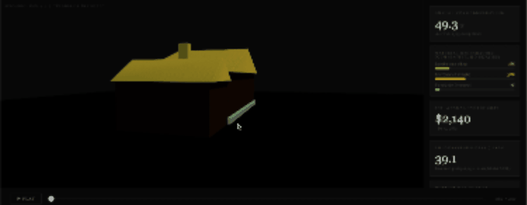

# 2110

a predictive climate model and lifecycle analysis for one house — 2110 blue lawn road.



built in support of the thesis *2110* by aisha kazembe.

*this is speculative modeling, built as part of an ongoing thesis exploration. outputs are estimates informed by published climate science and material research — not engineering assessments. the goal is to make data visible, not definitive.*

---

## what this is

this project takes 44 years of real daily weather data for iowa city and extends it 85 years into the future, ending in 2110 — the year the thesis is named for. it applies that projection to the physical structure of a single ranch-style house at 2110 blue lawn road, modeling how the building materials degrade over time as the climate changes.

the model assumes no retrofits. it asks: what happens to a home if nothing is done?

---

## the model

the climate projection is built in three layers:

**1980–2024 — observed**
era5 reanalysis data from the european centre for medium-range weather forecasts (ecmwf), retrieved via open-meteo. the gold standard for historical climate baselines.

**2025–2050 — near-future**
cmip6 ensemble projections from three international climate models (mpi_esm1_2_xr, mri_agcm3_2_s, ec_earth3p_hr), averaged to reduce individual model bias.

**2050–2110 — long-range**
ipcc sixth assessment report (ar6) ssp2-4.5 warming anomalies for the midwest, applied via delta scaling on the historical baseline. ssp2-4.5 — "middle of the road" — reflects current global policy trajectory.

---

## the materials

exterior painted pine siding is modeled using weathering rates from the usda forest products laboratory (wood handbook, fpl-gtr-282, 2021). stressors include heat above 90°f, freeze-thaw cracking, and moisture cycling from extreme rainfall.

roof degradation uses nrca asphalt shingle lifespan data (~30 years). foundation stress uses aci 318 freeze-thaw durability standards. energy costs are derived from eia iowa residential data, adjusted with heating and cooling degree days.

degradation rate multipliers are calibrated by the author, informed by published material science literature.

---

## files

```
climate_projection.py        — full climate projection pipeline (era5 → cmip6 → ipcc ar6)
model.py                     — historical weather ml model (scikit-learn)
iowa_weather_thesis.ipynb    — exploratory notebook version of model.py
house_impact.html            — 3d browser visualization with degradation heat map
climate_projection_ssp245.html — interactive plotly climate charts
projection_ssp245_iowa_city.csv — year-by-year projection data, 1980–2110
requirements.txt             — python dependencies
```

---

## run it

```bash
python -m venv .venv
source .venv/bin/activate
pip install -r requirements.txt

python climate_projection.py
```

open `house_impact.html` in any browser. no server needed.

---

## sources

- ecmwf / era5 — open-meteo.com
- cmip6 highresmic ensemble — open-meteo climate api
- ipcc ar6 wgi (2021) — ipcc.ch/report/ar6/wg1
- noaa ncei — iowa thunderstorm climatology
- usda forest products laboratory — wood handbook fpl-gtr-282 (2021)
- nrca — asphalt shingle lifespan standards
- aci 318 — concrete durability and freeze-thaw
- eia form 861 — iowa residential energy cost data

---

## thesis

*2110* explores the relationship between climate, home, and time through the lens of one house across 130 years of recorded and projected history. the place is specific; it is not named here. the digital model feeds a physical installation: a mini-model of the house, a projector, and data made visible in space.

→ aisha kazembe, 2026
